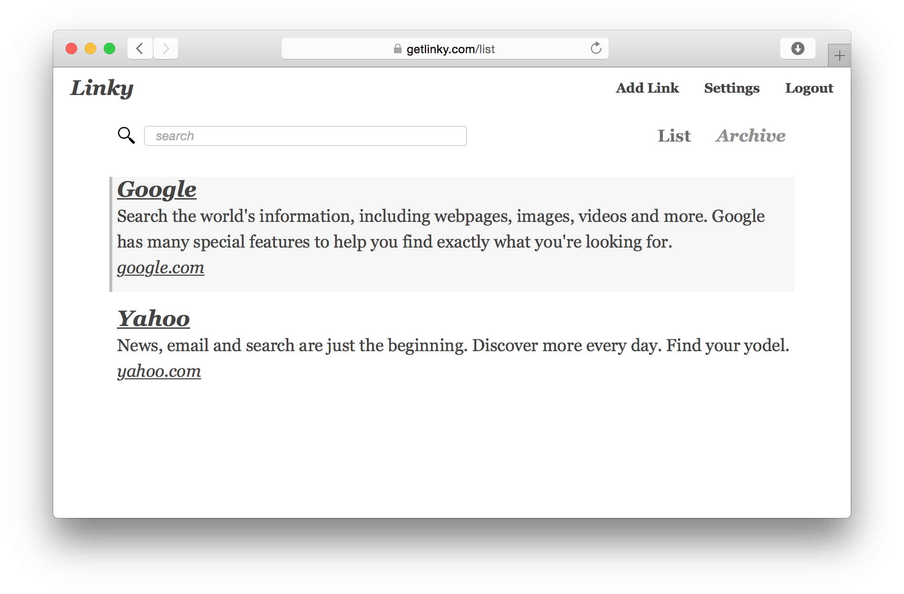

# linky

> A tool for storing links

Linky is a website for storing links and nothing more, with a focus on simple
to use keybinds for the utmost efficiency and ease of use.

Linky is powered by [Vue.js][1] on the frontend, and [Django-Rest-Framework][2] on the backend.

[1]: https://vuejs.org
[2]: http://www.django-rest-framework.org



## Browser Extensions

[chrome][3]

[firefox][4]

[3]: https://chrome.google.com/webstore/detail/linky/lejblldallegoffbjjogkmfnmnbkfgcg
[4]: https://addons.mozilla.org/en-US/firefox/addon/getlinky/

## Install
``` bash
git clone https://github.com/sbdchd/linky && cd linky
```

## Setup development environment
The django and frontend source files are mounted in docker so changes made locally will update the docker container.
``` bash
docker-compose -f docker-compose-dev.yml up

# navigate to http://localhost:8080

# stop
docker-compose -f docker-compose-prod.yml down
```

## Setup production environment
Be sure to Rename the `.env-example` file to `.env` and add the secrets for production.
``` bash
docker-compose -f docker-compose-prod.yml up

# navigate to http://localhost

# stop
docker-compose -f docker-compose-prod.yml down
```

## Deploying and redeploying changes to production
``` bash
# Find the machine name you want to deploy to
docker-machine ls
# Find command to set as active machine (in this case linky-sloth)
docker-machine env linky-sloth
# Set as active
eval $(docker-machine env linky-sloth)
# Deploy everything
docker-compose up -d --build
# Redeploy select service "web" without change others
docker-compose up --no-deps -d --build web
```
